# PROJECT-J Flow Diagrams
> **AI-Powered Cross-Cultural Pronunciation Learning Platform**
> 
> แอปพลิเคชันเรียนรู้การออกเสียงภาษาญี่ปุ่น-ไทย ด้วย AI

---

## 📑 Table of Contents

1. [System Architecture Overview](#1-system-architecture-overview)
2. [User Journey Flow](#2-user-journey-flow)
3. [Component Hierarchy](#3-component-hierarchy)
4. [Pronunciation Assessment Flow](#4-pronunciation-assessment-flow)
5. [Free Speak Mode Flow](#5-free-speak-mode-flow)
6. [API Data Flow](#6-api-data-flow)
7. [State Management](#7-state-management)
8. [Database / Data Structure](#8-database--data-structure)

---

## 1. System Architecture Overview

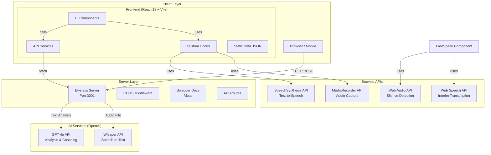

---

## 2. User Journey Flow

### 2.1 Onboarding & Language Selection

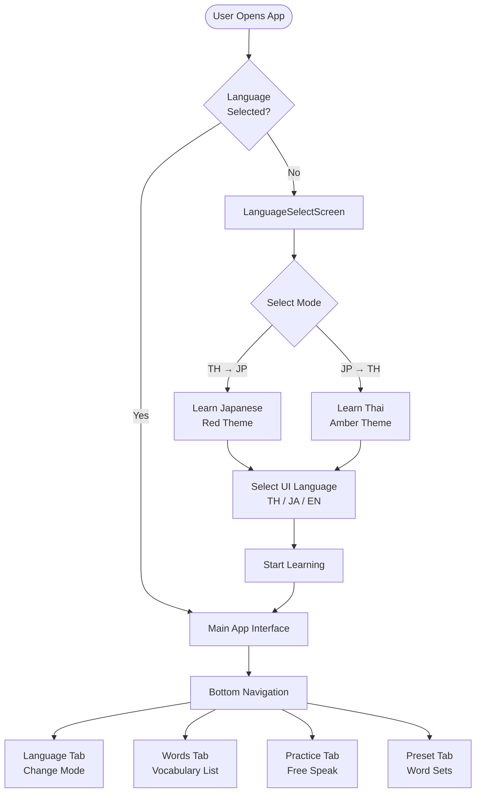

### 2.2 Vocabulary Learning Flow

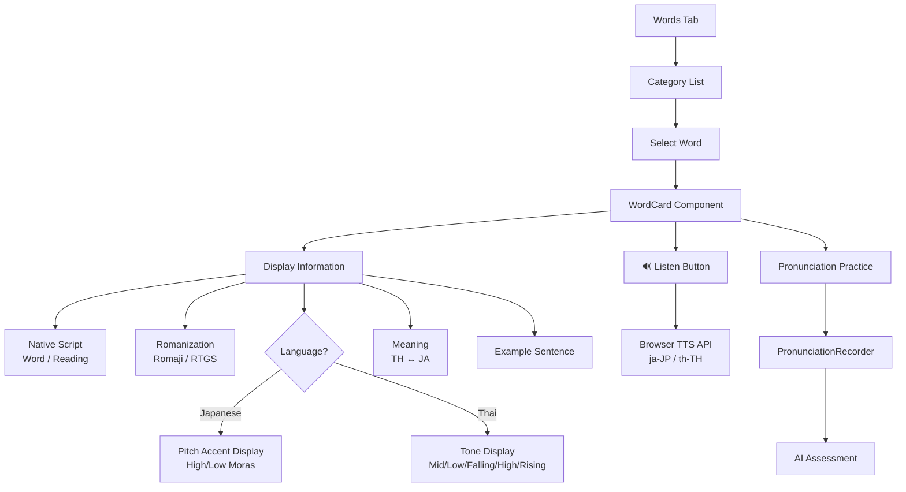

---

## 3. Component Hierarchy

```mermaid
graph TD
    App[App.tsx<br/>Main Container]
    
    subgraph "State Management"
        StateMode[mode: 'th-ja' | 'ja-th']
        StateAppLang[appLang: 'th' | 'ja' | 'en']
        StateActiveTab[activeTab: AppTab]
        StateSelected[selectedId: string | null]
        StatePreset[presetIds: string[] | null]
        StateResult[assessResult: AssessResponse | null]
    end
    
    App --> Header[Header<br/>Status & Mode Indicator]
    App --> MainContent[Main Content Area]
    App --> BottomNav[BottomNav<br/>Navigation]
    
    MainContent --> TabLanguage[LanguageSelectScreen]
    MainContent --> TabWords[Words Tab]
    MainContent --> TabPractice[Practice Tab<br/>FreeSpeak]
    MainContent --> TabPreset[PresetScreen]
    
    TabWords --> WordList[Word List Panel]
    TabWords --> WordDetail[Word Detail Panel]
    
    WordList --> GroupByCategory[Group by Category]
    WordDetail --> WordCard[WordCard]
    WordDetail --> PronunciationSection[Pronunciation Section]
    
    WordCard --> PitchDisplay[PitchDisplay<br/>Japanese]
    WordCard --> ToneDisplay[ToneDisplay<br/>Thai]
    WordCard --> TTSButton[TTS Button<br/>useTTS hook]
    
    PronunciationSection --> PronunciationRecorder[PronunciationRecorder]
    PronunciationSection --> AccuracyFeedback[AccuracyFeedback]
    
    PronunciationRecorder --> useAudioRecorder[useAudioRecorder Hook]
    PronunciationRecorder --> apiAssess[assessPronunciation API]
    
    TabPractice --> FreeSpeak[FreeSpeak Component]
    FreeSpeak --> SiriOrb[SiriOrb<br/>Voice Visualization]
    FreeSpeak --> MorphSurface[MorphSurface<br/>AI Input]
    FreeSpeak --> SentenceBreakdown[SentenceBreakdown]
    
    FreeSpeak --> useAudioRecorder2[useAudioRecorder]
    FreeSpeak --> apiTranscribe[transcribeAudio API]
    FreeSpeak --> apiLookup[lookupWord API]
    FreeSpeak --> apiTokenize[tokenizeSentence API]
```

---

## 4. Pronunciation Assessment Flow

### 4.1 Complete Assessment Pipeline

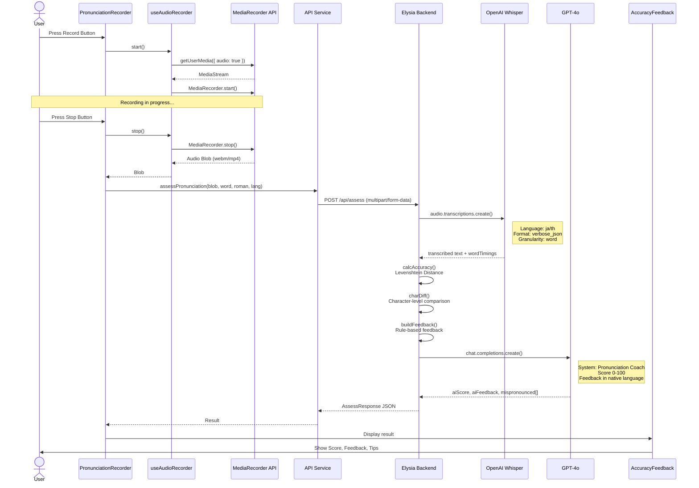

### 4.2 Assessment Data Transformation

```mermaid
flowchart LR
    subgraph "Input"
        Audio[Audio Blob<br/>webm/ogg/mp4/wav]
        Expected[Expected Word<br/>Native Script]
        Roman[Romanization<br/>Reading Guide]
        Lang[Language<br/>ja | th]
    end
    
    subgraph "Processing"
        Whisper[Whisper STT]
        Levenshtein[Levenshtein Distance]
        CharDiff[Character Diff]
        GPT[GPT-4o Analysis]
    end
    
    subgraph "Output"
        Transcribed[Transcribed Text]
        WordTiming[Word Timings<br/>start/end]
        Accuracy[Accuracy Score<br/>0-100]
        Diff[Char Diff Array<br/>correct/wrong/missing/extra]
        AIScore[AI Phonetic Score<br/>0-100]
        AIFeedback[AI Coaching<br/>Native Language]
        Mispronounced[Mispronounced<br/>Syllables[]]
    end
    
    Audio --> Whisper
    Whisper --> Transcribed
    Whisper --> WordTiming
    
    Expected --> Levenshtein
    Transcribed --> Levenshtein
    Levenshtein --> Accuracy
    
    Expected --> CharDiff
    Transcribed --> CharDiff
    CharDiff --> Diff
    
    Expected --> GPT
    Transcribed --> GPT
    WordTiming --> GPT
    Lang --> GPT
    GPT --> AIScore
    GPT --> AIFeedback
    GPT --> Mispronounced
```

---

## 5. Free Speak Mode Flow

### 5.1 Voice-First Interaction Flow

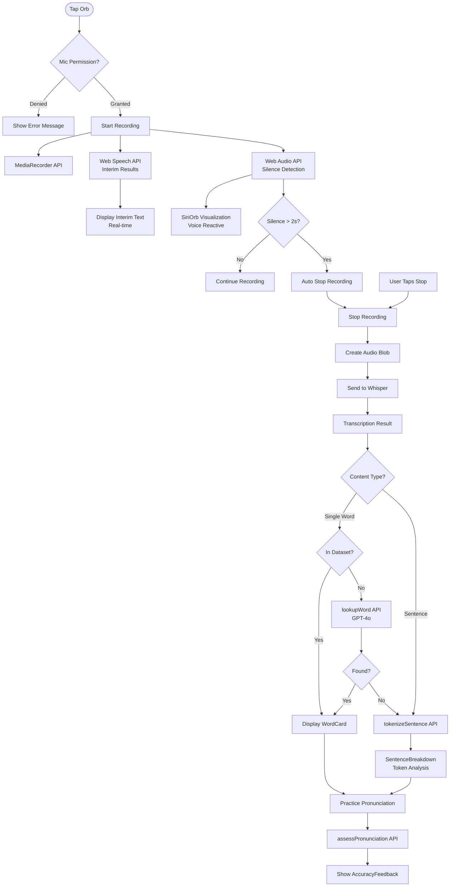

### 5.2 Dual Mode Architecture

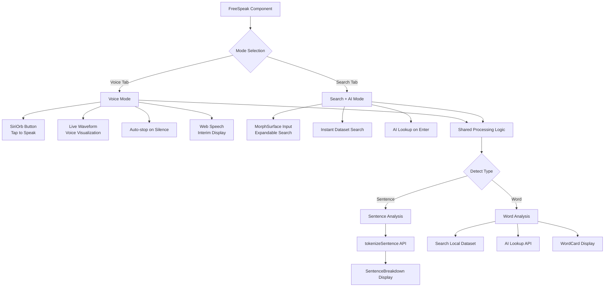

---

## 6. API Data Flow

### 6.1 API Endpoints Overview

```mermaid
flowchart LR
    subgraph "Frontend Services"
        apiAssess[assessPronunciation]
        apiTranscribe[transcribeAudio]
        apiLookup[lookupWord]
        apiTokenize[tokenizeSentence]
        apiHealth[checkHealth]
    end
    
    subgraph "Backend Routes<br/>/api"
        routeAssess[/assess<br/>POST multipart]
        routeTranscribe[/transcribe<br/>POST multipart]
        routeLookup[/lookup<br/>POST json]
        routeTokenize[/tokenize<br/>POST json]
        routeHealth[/health<br/>GET]
    end
    
    subgraph "OpenAI Integration"
        whisper1[Whisper-1<br/>STT]
        gpt4o[GPT-4o<br/>Analysis]
    end
    
    apiAssess --> routeAssess
    apiTranscribe --> routeTranscribe
    apiLookup --> routeLookup
    apiTokenize --> routeTokenize
    apiHealth --> routeHealth
    
    routeAssess --> whisper1
    routeTranscribe --> whisper1
    routeAssess --> gpt4o
    routeLookup --> gpt4o
    routeTokenize --> gpt4o
```

### 6.2 Request/Response Data Flow

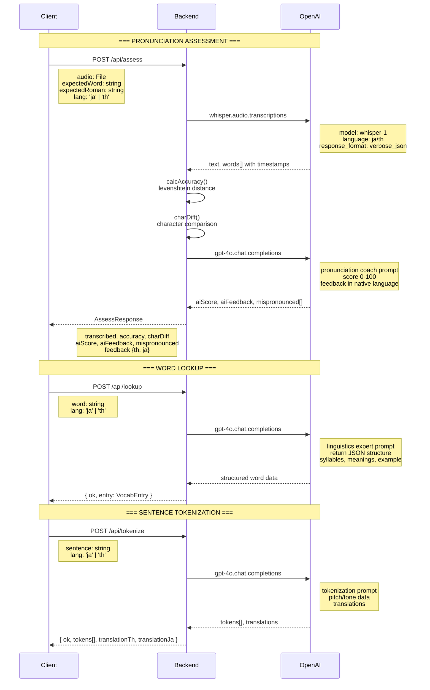

---

## 7. State Management

### 7.1 Global App State

```mermaid
flowchart TD
    subgraph "App.tsx State"
        mode[mode: LearnerMode<br/>'th-ja' | 'ja-th']
        appLang[appLang: AppLang<br/>'th' | 'ja' | 'en']
        activeTab[activeTab: AppTab<br/>'language' | 'words' | 'practice' | 'preset']
        selectedId[selectedId: string | null]
        presetIds[presetIds: string[] | null]
        assessResult[assessResult: AssessResponse | null]
        assessError[assessError: string | null]
        backendOk[backendOk: boolean | null]
        showWordDetail[showWordDetail: boolean]
        languageChosen[languageChosen: boolean]
    end
    
    subgraph "Computed Values"
        dataset[dataset: VocabEntry[]<br/>TH_JA or JA_TH]
        visibleList[visibleList: VocabEntry[]<br/>filtered by preset]
        grouped[grouped: Record<category, VocabEntry[]>]
        selectedEntry[selectedEntry: VocabEntry]
        isJapanese[isJapanese: boolean]
        accentColor[accentColor<br/>'red' | 'amber']
    end
    
    mode --> dataset
    mode --> isJapanese
    isJapanese --> accentColor
    presetIds --> visibleList
    dataset --> visibleList
    visibleList --> grouped
    selectedId --> selectedEntry
    dataset --> selectedEntry
```

### 7.2 Component State Breakdown

```mermaid
flowchart TD
    subgraph "PronunciationRecorder State"
        recState[state: 'idle' | 'recording' | 'processing']
        recHook[useAudioRecorder Hook]
    end
    
    subgraph "FreeSpeak State"
        recording[recording: boolean]
        loading[loading: boolean]
        transcribeResult[transcribeResult: TranscribeResponse | null]
        matchedEntry[matchedEntry: VocabEntry | null]
        practiceRecording[practiceRecording: boolean]
        practiceLoading[practiceLoading: boolean]
        assessResult2[assessResult: AssessResponse | null]
        interimText[interimText: string]
        speakMode[speakMode: 'voice' | 'search']
        searchQuery[searchQuery: string]
        sentenceTokens[sentenceTokens: SentenceToken[] | null]
    end
    
    subgraph "Hooks State"
        audioState[AudioRecorder State]
        ttsState[TTS State<br/>speaking: boolean]
    end
    
    subgraph "Refs (Persistent)"
        mediaRef[mediaRecorder Ref]
        streamRef[micStream Ref]
        audioCtxRef[audioContext Ref]
        srRef[speechRecognition Ref]
        orbRef[orb DOM Ref]
    end
```

---

## 8. Database / Data Structure

### 8.1 Vocabulary Entry Structure

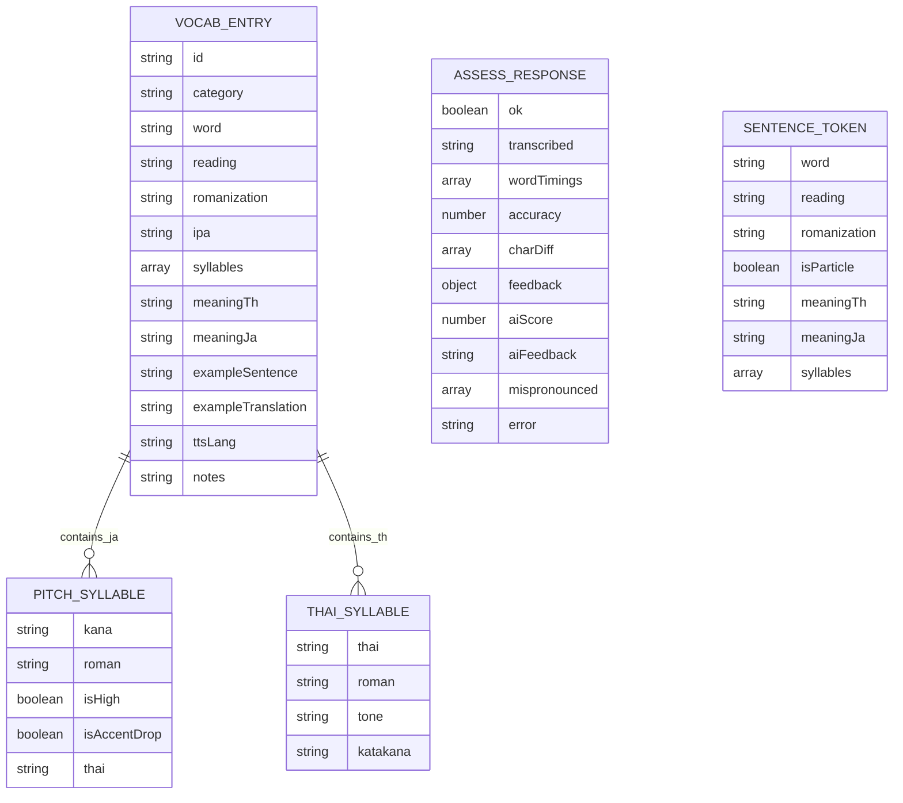

### 8.2 Data File Organization

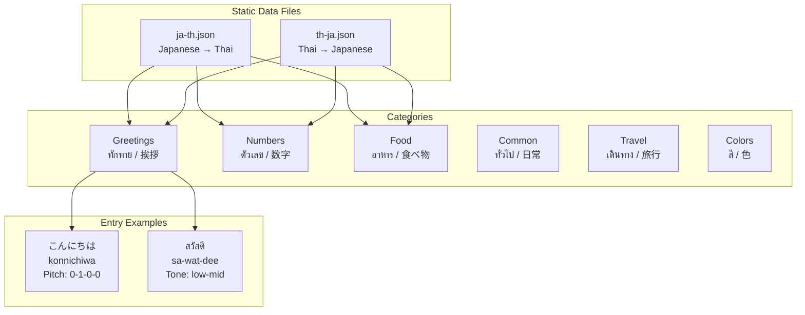

---

## 9. Algorithm Flowcharts

### 9.1 Levenshtein Distance Algorithm

```mermaid
flowchart TD
    Start([Input: strings a, b]) --> Init[Initialize DP matrix<br/>m x n]
    Init --> FillBase[Fill base cases<br/>dp[i][0] = i<br/>dp[0][j] = j]
    
    FillBase --> Loopi[For i = 1 to m]
    Loopi --> Loopj[For j = 1 to n]
    Loopj --> CheckChar{a[i-1] == b[j-1]?}
    
    CheckChar -->|Yes| Copy[dp[i][j] = dp[i-1][j-1]]
    CheckChar -->|No| Min[dp[i][j] = 1 + min<br/>dp[i-1][j]<br/>dp[i][j-1]<br/>dp[i-1][j-1]]
    
    Copy --> NextJ{More j?}
    Min --> NextJ
    NextJ -->|Yes| Loopj
    NextJ -->|No| NextI{More i?}
    
    NextI -->|Yes| Loopi
    NextI -->|No| Return[Return dp[m][n]]
    Return --> CalcAcc[Calculate Accuracy<br/>((len - dist) / len) * 100]
```

### 9.2 Character Diff Algorithm

```mermaid
flowchart TD
    Start([Input: expected, transcribed]) --> Normalize[Normalize to lowercase<br/>Remove spaces]
    
    Normalize --> InitLoop[maxLen = max(lenA, lenB)]
    InitLoop --> Loop[For i = 0 to maxLen-1]
    
    Loop --> GetChars[ec = expected[i]<br/>gc = transcribed[i]]
    GetChars --> CheckBoth{ec && gc?}
    
    CheckBoth -->|Yes| Compare{ec == gc?}
    Compare -->|Yes| MarkCorrect[status: 'correct']
    Compare -->|No| MarkWrong[status: 'wrong']
    
    CheckBoth -->|No| CheckMissing{ec && !gc?}
    CheckMissing -->|Yes| MarkMissing[status: 'missing']
    CheckMissing -->|No| CheckExtra{!ec && gc?}
    CheckExtra -->|Yes| MarkExtra[status: 'extra']
    
    MarkCorrect --> AddResult[Add to result array]
    MarkWrong --> AddResult
    MarkMissing --> AddResult
    MarkExtra --> AddResult
    
    AddResult --> More{More chars?}
    More -->|Yes| Loop
    More -->|No| Return[Return CharDiff[]]
```

### 9.3 Silence Detection Algorithm

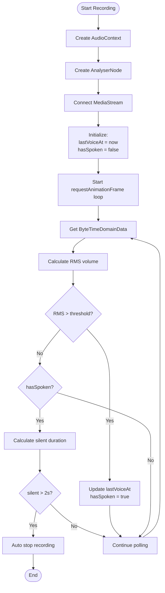

---

## 10. Error Handling Flow

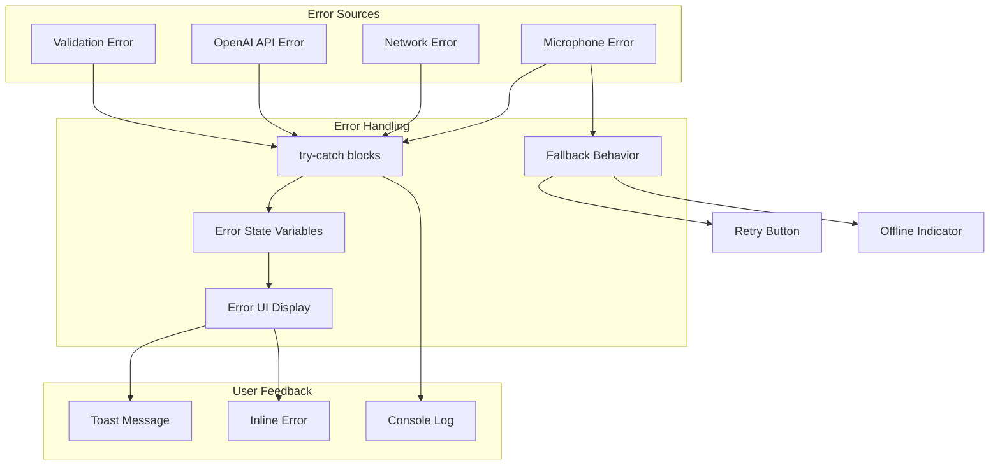

---

## 11. Browser Compatibility Flow

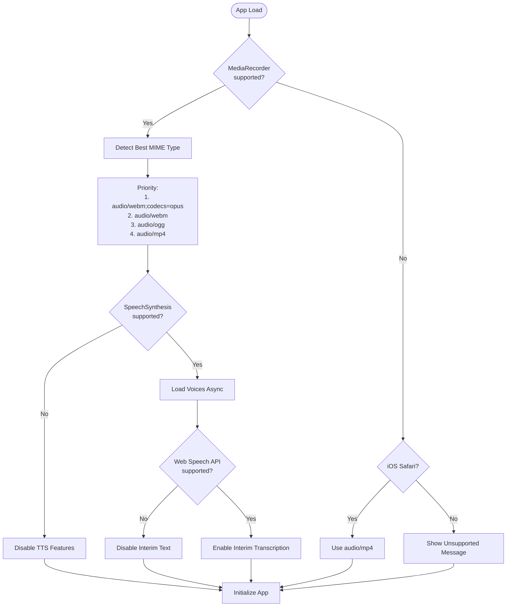

---

## สรุป (Summary)

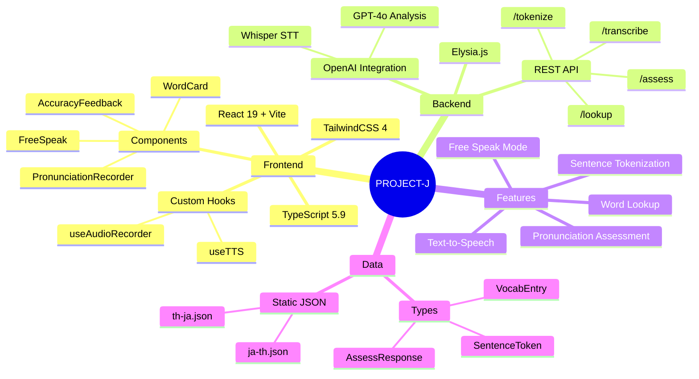

---

*สร้างเมื่อ: 2026-03-09*
*เวอร์ชัน: 1.0*
